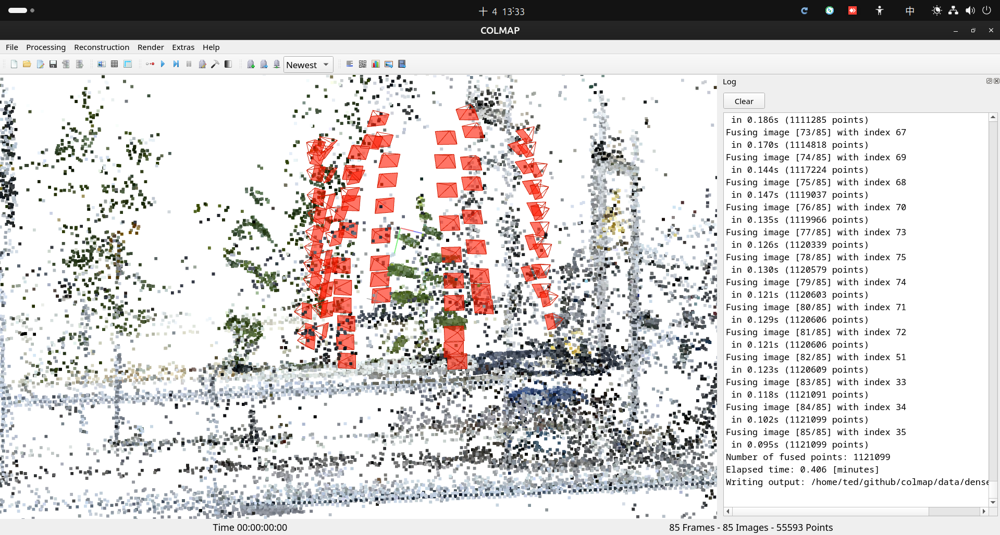
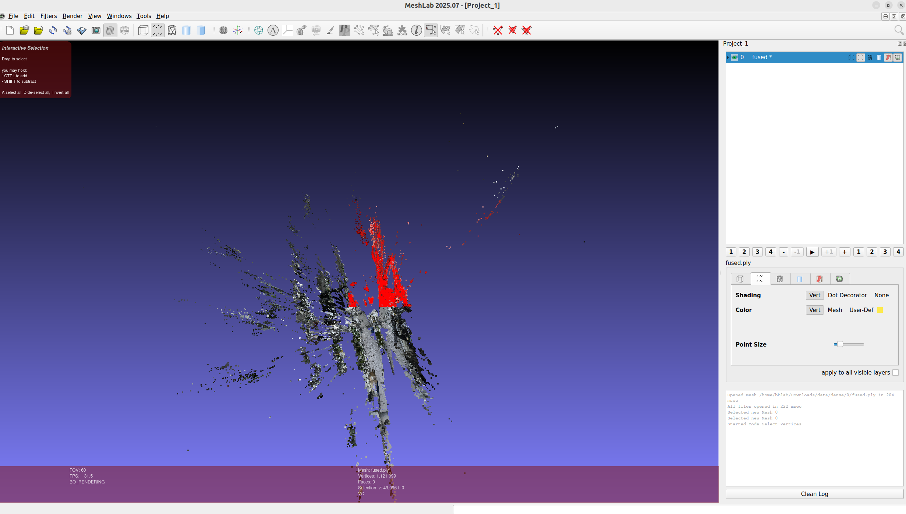
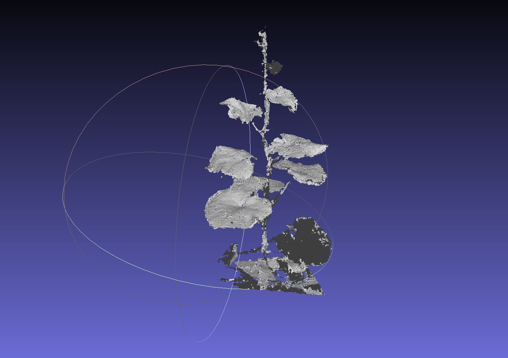
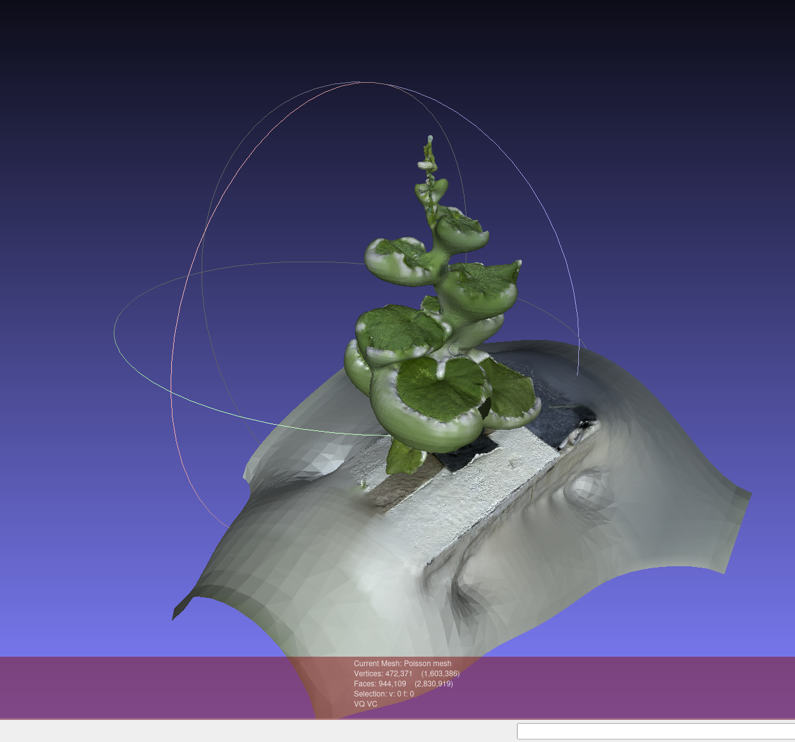
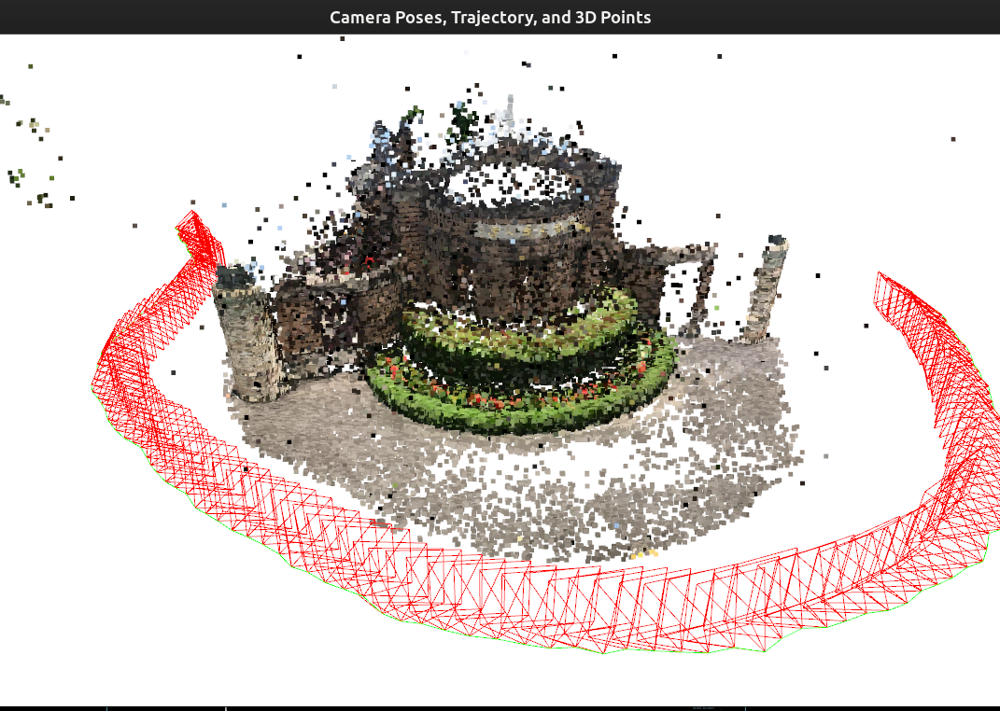

# 3DCV 2025 Homework 2 Report

**Student ID:** R13631026
**Name:** Kuan Chen Lin
**Due Date:** 2025-10-13

---

## Table of Contents
- [3DCV 2025 Homework 2 Report](#3dcv-2025-homework-2-report)
  - [Table of Contents](#table-of-contents)
  - [Problem 1: COLMAP](#problem-1-colmap)
    - [Q1-1: Structure from Motion](#q1-1-structure-from-motion)
      - [Data Acquisition](#data-acquisition)
      - [Method](#method)
      - [Results](#results)
    - [Q1-2: Point Cloud to Mesh Conversion](#q1-2-point-cloud-to-mesh-conversion)
      - [Method](#method-1)
      - [Results](#results-1)
  - [Problem 2: Camera Relocalization](#problem-2-camera-relocalization)
    - [Q2-1: Camera Pose Estimation](#q2-1-camera-pose-estimation)
      - [Step 1: 2D-3D Matching and PnP](#step-1-2d-3d-matching-and-pnp)
      - [Step 2: Pose Error Calculation](#step-2-pose-error-calculation)
      - [Step 3: Visualization with Open3D](#step-3-visualization-with-open3d)
    - [Q2-2: Augmented Reality](#q2-2-augmented-reality)
      - [Method](#method-2)
  - [References](#references)
  - [Acknowledgments](#acknowledgments)

---

## Problem 1: COLMAP

### Q1-1: Structure from Motion

#### Data Acquisition
I captured a video of the **NTU Greenhouse** using a smartphone camera, focusing on one plant.

#### Method

I took a video around one plant at various height. I left sufficient spacing between the camera views to ensure good coverage while avoiding redundant images.

**Step 2: COLMAP Reconstruction**
I used COLMAP's gui automatic reconstruction pipeline to perform Structure from Motion.

#### Results

**COLMAP GUI Visualization:**




**Challenges Encountered:**
- to get good quality reconstruction, I use a large FOV to include enough background for feature tracking. 
- spacing between the camera views should not be too large, need sufficient overlapping between two views.

**Video Demonstration:**

**YouTube Link:** [Your YouTube Video Link for Q1-1]

---

### Q1-2: Point Cloud to Mesh Conversion

#### Method

I used **MeshLab** to convert the sparse point cloud from COLMAP into a 3D triangle mesh.

**Pipeline:**

1. **Import point cloud from COLMAP**: PLY format (dense reconstruction ply, a product from Q1-1)
2. **Clean the point cloud** in MeshLab:
   - manually remove background points.

   

   *Figure: Cleaning process showing outliers (in red) being removed from the point cloud*

3. **Apply Surface Reconstruction**

#### Results

**Final Mesh:** I tried two surface reconstruction methods. 



*Figure: Ball pivoting reconstructed mesh showing the plant structure*



*Figure: Poisson mesh reconstruction does not look good in my case*

**Video Demonstration:**

**YouTube Link:** [Your YouTube Video Link for Q1-2]

---

## Problem 2: Camera Relocalization

### Q2-1: Camera Pose Estimation

#### Step 1: 2D-3D Matching and PnP

**Method:**
1. **Descriptor Matching:** Used BFMatcher with L2 norm and Lowe's ratio test (0.75 threshold)
2. **PnP Solution:** `cv2.solvePnPRansac` with EPNP algorithm
   - RANSAC iterations: 100
   - Reprojection error: 8.0 pixels
   - Confidence: 0.99

**Implementation:** See `2d3dmatching.py` - `pnpsolver()` function

#### Step 2: Pose Error Calculation

**Rotation Error:**
- Compute relative rotation: R_rel = R_est @ R_gt^T
- Extract angle using trace formula: θ = arccos((trace(R_rel) - 1) / 2)
- Report median angle in degrees

**Translation Error:**
- Euclidean distance: ||t_est - t_gt||^2
- Report median distance

**Results:**
```
Median Rotation Error: 0.0152 degrees
Median Translation Error: 0.0015
```

#### Step 3: Visualization with Open3D

**Method:**
- Draw camera poses as quadrangular pyramids (red)
- Apex = optical center, base = camera orientation
- Green trajectory line connecting camera positions in sequence order
- Display with 3D point cloud (NTU Front Gate)



*Figure: Visualization showing estimated camera poses (red pyramids), trajectory (green line), and 3D point cloud of the scene*

**Video Demonstration:**

**YouTube Link:** [Your YouTube Video Link for Q2-1]

---

### Q2-2: Augmented Reality

#### Method

**Step 1: Position Virtual Cube** (`transform_cube.py`)
- Interactively place cube in 3D scene
- Controls: translate (A/S/D), rotate (Z/X/C), scale (V)
- Save transformation to `cube_transform_mat.npy`

**Step 2: Generate AR Video** (`ar_cube_video.py`)
1. **Create cube voxels:** Generate point grid on cube surface with different colors per face
2. **Painter's Algorithm:**
   - For each frame, compute voxel depth (Z-coordinate in camera space)
   - Sort voxels from furthest to closest
   - Draw voxels in order to handle occlusion
3. **Projection:** Transform 3D voxels to 2D image coordinates using camera parameters
4. **Render:** Draw colored circles on validation images

**Implementation highlights:**
- Cube density: 15-20 voxels per edge
- Point size: 3-4 pixels
- Video: 30 FPS, 1920×1080

[video](ar_cube_output.mp4) can be found in the project folder ar_cube_output.mp4

**Video Demonstration:**

**YouTube Link:** [Your YouTube Video Link for Q2-2]

---

## References

1. Schönberger, J. L., & Frahm, J. M. (2016). Structure-from-Motion Revisited. *CVPR*.
2. COLMAP Documentation: https://colmap.github.io/

---

## Acknowledgments

- **LLM Used:** Claude 3.5 Sonnet (Anthropic)
- **Tasks Performed by LLM:**
  - Report structure and formatting
  - Technical writing assistance
  - Documentation of methodology
- **Extent of Contribution:** ~30% (writing assistance, code fix)
---
